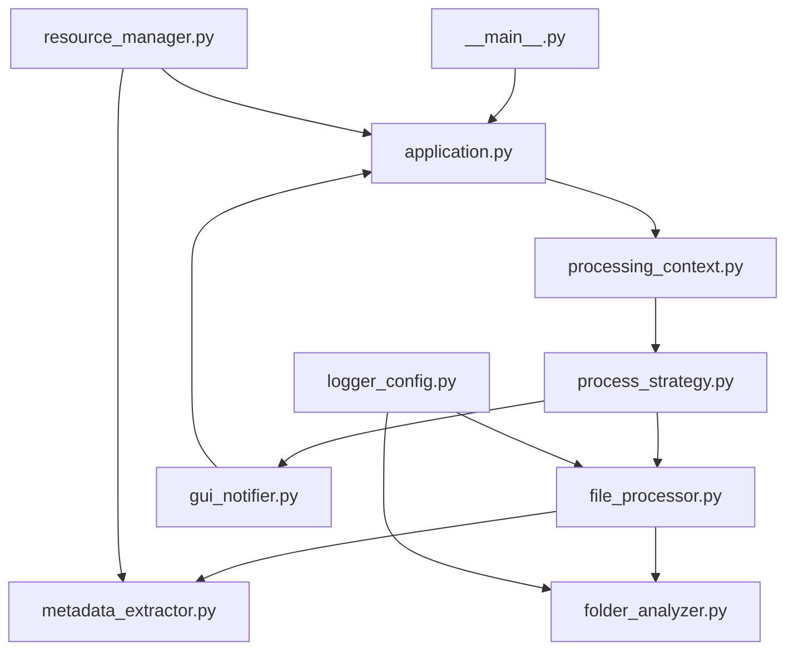

# Estructura del Proyecto

## Visión General

El proyecto GestionExpedienteElectronico_Version1 sigue una estructura organizada que separa claramente las responsabilidades según el patrón **MVC (Model-View-Controller)** con componentes especializados.

## Estructura de Directorios

```
GestionExpedienteElectronico_Version1/
├── 📁 src/                          # Código fuente principal
│   ├── 📄 __main__.py              # Punto de entrada de la aplicación
│   ├── 📁 model/                   # Capa de Modelo - Lógica de negocio
│   │   ├── 📄 __init__.py
│   │   ├── 📄 file_processor.py    # Motor principal de procesamiento
│   │   ├── 📄 metadata_extractor.py # Factory para extractores
│   │   ├── 📄 folder_analyzer.py   # Análisis de estructura de carpetas
│   │   └── 📄 logger_config.py     # Configuración de logging
│   ├── 📁 view/                    # Capa de Vista - Interfaz gráfica
│   │   ├── 📄 __init__.py
│   │   ├── 📄 application.py       # GUI principal (Tkinter)
│   │   ├── 📄 tooltip.py           # Sistema de ayuda interactivo
│   │   └── 📄 tools_launcher.py    # Ventana de herramientas
│   ├── 📁 controller/              # Capa de Controlador - Coordinación
│   │   ├── 📄 __init__.py
│   │   ├── 📄 processing_context.py # Coordinador del patrón Strategy
│   │   ├── 📄 process_strategy.py  # Estrategias de procesamiento
│   │   └── 📄 gui_notifier.py      # Patrón Observer para GUI
│   ├── 📁 utils/                   # Utilidades generales
│   │   ├── 📄 __init__.py
│   │   └── 📄 resource_manager.py  # Gestión de recursos multiplataforma
│   ├── 📁 assets/                  # Recursos estáticos
│   │   ├── 📄 000IndiceElectronicoC0.xlsm # Template Excel
│   │   ├── 📄 JUZGADOS.csv         # Datos de referencia
│   │   ├── 📄 TRD.csv              # Clasificación documental
│   │   ├── 📄 last_version.json    # Control de versiones
│   │   └── 🖼️ [imágenes UI]         # Iconos y recursos gráficos
│   └── 📁 test/                    # Suite de pruebas
│       ├── 📄 test.py              # Tests principales
│       ├── 📄 test_page_counter.py # Tests conteo páginas
│       └── 📄 test_excel_manipulation.py # Tests Excel
├── 📁 config/                      # Configuración de build
│   ├── 📄 main.spec               # Configuración PyInstaller
│   └── 📄 README.MD               # Documentación de configuración
├── 📁 docs/                       # Documentación técnica (legacy)
├── 📁 logs/                       # Archivos de log de la aplicación
├── 📁 build/                      # Archivos temporales de build
├── 📁 dist/                       # Ejecutables generados
├── 📄 requirements.txt            # Dependencias Python
├── 📄 README.md                   # Documentación principal
├── 📄 LICENSE                     # Licencia del proyecto
└── 📄 CLAUDE.md                   # Instrucciones para Claude Code
```

## Detalle de Componentes Principales

### Entry Point

#### `src/__main__.py`
```python
"""
Punto de entrada principal de la aplicación.
Responsabilidades:
- Inicialización del sistema
- Configuración de logging
- Lanzamiento de la GUI principal
"""
```

**Características**:
- Configuración inicial del sistema
- Manejo de argumentos de línea de comandos
- Inicialización de logging
- Bootstrap de la aplicación GUI

### Capa Model - Lógica de Negocio

#### `src/model/file_processor.py`
```python
class FileProcessor:
    """
    Motor central de procesamiento con integración Excel/xlwings.
    
    Responsabilidades:
    - Generación de índices Excel con fórmulas automáticas
    - Coordinación de extracción de metadatos
    - Manejo de errores y recuperación
    - Interfaz con Excel COM automation
    """
```

**Métodos principales**:
- `process_files(folder_path: str) -> bool`
- `generate_excel_index(data: List[Dict]) -> str`
- `apply_excel_formulas(workbook: xlwings.Book) -> None`

#### `src/model/metadata_extractor.py`
```python
class MetadataExtractorFactory:
    """
    Factory Pattern para creación de extractores especializados.
    
    Soporta:
    - PDF (PyPDF2 + manejo de archivos protegidos)
    - Word (.docx, .doc)
    - Excel (.xlsx, .xls)
    """
    
    @staticmethod
    def create_extractor(file_path: str) -> BaseExtractor
```

**Extractores implementados**:
- `PDFExtractor`: Extracción de páginas y metadatos PDF
- `WordExtractor`: Análisis de documentos Word
- `ExcelExtractor`: Metadatos de hojas de cálculo

#### `src/model/folder_analyzer.py`
```python
class FolderAnalyzer:
    """
    Análisis profundo de estructura de carpetas y validación CUI.
    
    Capacidades:
    - Validación de estructura jerárquica
    - Detección de CUIs inválidos (23 dígitos)
    - Identificación de subcarpetas problemáticas
    - Análisis de compliance con estándares judiciales
    """
```

#### `src/model/logger_config.py`
```python
class LoggerConfig:
    """
    Configuración centralizada de logging con rotación.
    
    Características:
    - Rotación automática de logs
    - Múltiples niveles (DEBUG, INFO, WARNING, ERROR)
    - Formato estandarizado
    - Persistencia en directorio logs/
    """
```

### Capa View - Interfaz Gráfica

#### `src/view/application.py`
```python
class Application:
    """
    GUI principal COMPLETAMENTE UNIFICADA (~730 líneas).
    
    Responsabilidades EXCLUSIVAMENTE de GUI:
    - Creación y gestión de widgets Tkinter
    - Manejo de eventos de usuario (clicks, selecciones)
    - Flujo 100% unificado para las 3 estrategias
    - Control de estado visual
    - Gestión de versiones y actualizaciones
    """
```

**Características destacadas**:
- **Flujo unificado**: `obtener_rutas()` y `procesa_expedientes()` idénticos
- **Eliminación de duplicación**: Sin manejo diferenciado por `selected_value`
- **Reducción del 20%**: Código más limpio y mantenible
- **Observer integration**: Recepción de notificaciones en tiempo real

#### `src/view/tooltip.py`
```python
class ToolTip:
    """
    Sistema de ayuda interactivo con imágenes.
    
    Funcionalidades:
    - Tooltips contextuales
    - Soporte para imágenes
    - Posicionamiento dinámico
    - Integración seamless con GUI principal
    """
```

#### `src/view/tools_launcher.py`
```python
class ToolsLauncher:
    """
    Ventana de herramientas adicionales.
    
    Proporciona:
    - Banco de herramientas complementarias
    - Utilidades de mantenimiento
    - Funciones auxiliares para usuarios
    """
```

### Capa Controller - Coordinación

#### `src/controller/processing_context.py`
```python
class ProcessingContext:
    """
    Coordinador SIMPLIFICADO del patrón Strategy.
    
    Responsabilidades:
    - Gestión de intercambio dinámico de estrategias
    - Coordinación entre GUI y estrategias
    - Manejo de estado de procesamiento
    """
    
    def set_strategy(self, strategy: ProcessStrategy) -> None
    def execute_processing(self) -> bool
```

#### `src/controller/process_strategy.py`
```python
class ProcessStrategy(ABC):
    """
    Clase base para estrategias 100% AUTÓNOMAS.
    
    Cada implementación maneja:
    - Selección de carpeta propia con filedialog
    - Validación de estructura específica
    - Confirmaciones de usuario
    - Procesamiento independiente
    - Notificaciones GUI via Observer
    """
```

**Estrategias implementadas**:

##### `SingleCuadernoStrategy`
```python
class SingleCuadernoStrategy(ProcessStrategy):
    """
    Procesamiento de cuaderno único - Estructura plana.
    
    Características:
    - Validación CUI individual (string)
    - Detección automática de anexos masivos
    - Procesamiento directo de archivos
    """
```

##### `SingleExpedienteStrategy`
```python
class SingleExpedienteStrategy(ProcessStrategy):
    """
    Procesamiento de expediente único - 4 niveles jerárquicos.
    
    Niveles: Expediente → Instancia → Cuaderno → Archivos
    - Validación CUI en conjunto (set)
    - Manejo complejo de subcarpetas
    - Reportes detallados de estructura
    """
```

##### `MultiExpedienteStrategy`
```python
class MultiExpedienteStrategy(ProcessStrategy):
    """
    Procesamiento múltiple - 5 niveles jerárquicos.
    
    Niveles: Año → Expediente → Instancia → Cuaderno → Archivos
    - Validación masiva de CUIs
    - Procesamiento batch escalable
    - Reportes consolidados
    """
```

#### `src/controller/gui_notifier.py`
```python
class GUINotifier:
    """
    Patrón Observer UNIFICADO para todas las estrategias.
    
    Tipos de mensaje:
    - MessageType.PROGRESS: Actualización barras de progreso
    - MessageType.STATUS: Mensajes de estado
    - MessageType.TEXT: Log de actividad
    - MessageType.DIALOG: Diálogos de interacción
    """
```

### Utilidades

#### `src/utils/resource_manager.py`
```python
class ResourceManager:
    """
    Gestión multiplataforma de rutas y recursos.
    
    Características:
    - Detección automática entorno desarrollo vs producción
    - Rutas absolutas multiplataforma
    - Acceso a assets independiente del contexto de ejecución
    """
```

### Recursos y Assets

#### `src/assets/`
Directorio que contiene todos los recursos estáticos necesarios:

- **`000IndiceElectronicoC0.xlsm`**: Template Excel oficial para índices
- **`JUZGADOS.csv`**: Base de datos de juzgados colombianos
- **`TRD.csv`**: Clasificación de tipos documentales (TRD)
- **`last_version.json`**: Control de versiones para actualizaciones automáticas
- **Imágenes UI**: Iconos, logos y recursos gráficos

#### Archivos de Datos de Referencia

##### `JUZGADOS.csv`
```csv
codigo,nombre,ciudad,especialidad
001,Juzgado Primero Civil Municipal,Bogotá,Civil
002,Juzgado Segundo Penal del Circuito,Medellín,Penal
...
```

##### `TRD.csv` - Tabla de Retención Documental
```csv
codigo,tipo_documento,tiempo_retencion,disposicion
001,Demanda,Permanente,Conservar
002,Contestación,10 años,Eliminar
...
```

### Testing

#### `src/test/`
Suite de pruebas para validación de funcionalidades:

- **`test.py`**: Tests generales de funcionalidad
- **`test_page_counter.py`**: Validación de conteo de páginas
- **`test_excel_manipulation.py`**: Tests de automatización Excel

## Configuración y Build

### `config/main.spec`
Archivo de configuración de PyInstaller para generación de ejecutables:

```python
# -*- mode: python ; coding: utf-8 -*-
# Configuración completa para empaquetado con PyInstaller
# Incluye manejo de dependencias y recursos
```

### `requirements.txt`
```
xlwings==0.28.5          # Automatización Excel (crítico)
pandas==1.5.2            # Manipulación de datos
PyPDF2==2.11.2          # Procesamiento PDF
pywin32==306             # Integración COM Windows
Pillow>=8.3.2            # Procesamiento de imágenes
send2trash>=1.8.0        # Eliminación segura de archivos
```

## Patrones de Dependencias



## Principios de Organización

### Separación de Responsabilidades
- **Model**: Lógica de negocio pura, sin dependencias GUI
- **View**: Interfaz gráfica exclusivamente, sin lógica de negocio
- **Controller**: Coordinación y flujo, actuando como intermediario

### Inversión de Dependencias
- **Abstracciones**: Estrategias dependen de interfaces, no implementaciones
- **Inyección**: Notificadores y loggers inyectados, no instanciados directamente
- **Configuración**: Dependencias configurables via parámetros

### Cohesión Alta
- **Funcionalidades relacionadas agrupadas** en módulos específicos
- **Responsabilidades bien definidas** para cada clase
- **Interfaz mínima** entre componentes

---

!!! info "Navegación de Código"
    Para explorar el código en detalle, visita las páginas específicas de cada capa: [Model](model.md), [View](view.md), [Controller](controller.md).