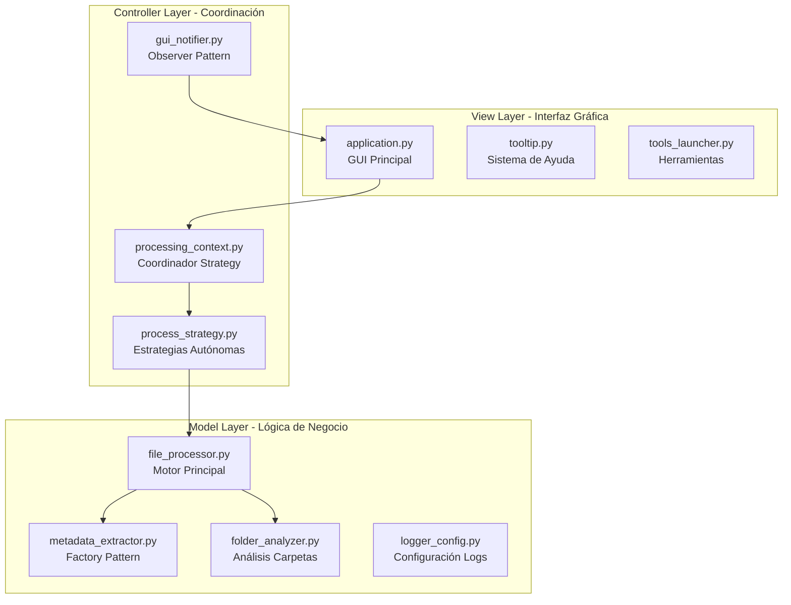
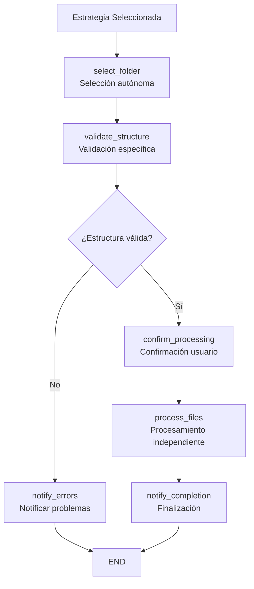
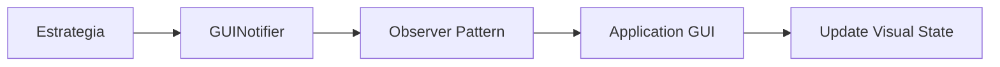

# Visión General de la Arquitectura

## Introducción

GestionExpedienteElectronico_Version1 implementa una arquitectura robusta basada en el patrón **MVC (Model-View-Controller)** combinado con el **patrón Strategy**, diseñada para maximum escalabilidad, mantenibilidad y extensibilidad.

## Principios Arquitectónicos

### Separación de Responsabilidades

La aplicación sigue estrictamente el principio de **separación de responsabilidades**, donde cada capa tiene un propósito específico y bien definido:



### Patrones de Diseño Implementados

#### 1. Strategy Pattern (Completamente Autónomo)
Cada estrategia de procesamiento es **100% independiente** y autosuficiente:

- **SingleCuadernoStrategy**: Procesamiento de cuaderno único
- **SingleExpedienteStrategy**: Procesamiento de expediente individual  
- **MultiExpedienteStrategy**: Procesamiento de múltiples expedientes

#### 2. Observer Pattern (Unificado)
Sistema de notificaciones en tiempo real entre controladores y vista:

- **MessageType.PROGRESS**: Actualización de barras de progreso
- **MessageType.STATUS**: Mensajes de estado
- **MessageType.TEXT**: Log de actividad
- **MessageType.DIALOG**: Diálogos de interacción

#### 3. Factory Pattern
Creación dinámica de extractores según tipo de archivo:

- **PDFExtractor**: Archivos PDF
- **WordExtractor**: Documentos Word (.docx, .doc)
- **ExcelExtractor**: Hojas de cálculo Excel

#### 4. Dependency Injection
Inyección de dependencias para desacoplamiento:

- Notificadores GUI
- Configuradores de logging
- Contextos de procesamiento

## Arquitectura Detallada por Capas

### Model Layer - Lógica de Negocio Pura

#### `file_processor.py` - Motor Principal
```python
class FileProcessor:
    """
    Motor central de procesamiento con integración Excel/xlwings.
    Responsabilidades:
    - Generación de índices Excel con fórmulas automáticas
    - Coordinación de extracción de metadatos
    - Manejo de errores y recuperación
    """
```

**Características clave**:
- Integración directa con Excel via xlwings
- Manejo robusto de excepciones
- Generación de fórmulas automáticas
- Soporte para múltiples formatos

#### `metadata_extractor.py` - Factory Pattern
```python
class MetadataExtractorFactory:
    """
    Factory para creación de extractores especializados.
    Implementa estrategia de extracción por tipo de archivo.
    """
    
    @staticmethod
    def create_extractor(file_path: str) -> BaseExtractor:
        """Crea extractor apropiado según extensión."""
```

**Extractores implementados**:
- **PDFExtractor**: PyPDF2 + manejo de archivos protegidos
- **WordExtractor**: python-docx + análisis de estructura
- **ExcelExtractor**: pandas + xlwings para metadatos avanzados

#### `folder_analyzer.py` - Análisis Profundo
```python
class FolderAnalyzer:
    """
    Análisis exhaustivo de estructura de carpetas.
    Responsabilidades:
    - Validación de estructura jerárquica
    - Detección de CUIs inválidos
    - Identificación de subcarpetas problemáticas
    """
```

### Controller Layer - Coordinación y Estrategias

#### `processing_context.py` - Coordinador Unificado
```python
class ProcessingContext:
    """
    Coordinador del patrón Strategy simplificado.
    Gestiona intercambio dinámico de estrategias.
    """
    
    def set_strategy(self, strategy: ProcessStrategy):
        """Configura estrategia de procesamiento."""
        
    def execute_processing(self) -> bool:
        """Ejecuta procesamiento con estrategia actual."""
```

#### `process_strategy.py` - Estrategias Autónomas
```python
class ProcessStrategy(ABC):
    """
    Clase base abstracta para estrategias de procesamiento.
    Cada estrategia es completamente autónoma e independiente.
    """
    
    @abstractmethod
    def select_folder(self) -> str:
        """Selección autónoma de carpeta."""
        
    @abstractmethod
    def validate_structure(self, folder_path: str) -> bool:
        """Validación específica de estructura."""
        
    @abstractmethod
    def process_files(self, folder_path: str) -> bool:
        """Procesamiento autónomo de archivos."""
```

**Estrategias implementadas**:

##### SingleCuadernoStrategy
- **Estructura**: Plana (archivos directos)
- **Validación**: CUI individual (string)
- **Autonomía**: 100% independiente con filedialog propio

##### SingleExpedienteStrategy  
- **Estructura**: 4 niveles jerárquicos
- **Validación**: CUI en conjunto (set)
- **Niveles**: `Expediente → Instancia → Cuaderno → Archivos`

##### MultiExpedienteStrategy
- **Estructura**: 5 niveles jerárquicos
- **Validación**: Múltiples CUIs con reportes
- **Niveles**: `Año → Expediente → Instancia → Cuaderno → Archivos`

### View Layer - Interfaz Gráfica Unificada

#### `application.py` - GUI Principal (Completamente Refactorizada)
```python
class Application:
    """
    Interfaz gráfica principal COMPLETAMENTE UNIFICADA.
    
    Responsabilidades EXCLUSIVAMENTE de GUI:
    - Creación y gestión de widgets Tkinter
    - Manejo de eventos de usuario
    - Flujo 100% unificado para las 3 estrategias
    - Control de estado visual
    """
```

**Eliminación total de duplicación**:
- Flujo idéntico `obtener_rutas()` y `procesa_expedientes()`
- Sin manejo diferenciado por `selected_value`
- Reducción del 20% en líneas de código
- Aproximadamente 730 líneas de código limpio

## Flujo de Procesamiento Unificado

### 1. Selección de Estrategia
```mermaid
graph LR
    A[Usuario selecciona tipo] --> B{Tipo de procesamiento}
    B -->|selected_value = "1"| C[SingleCuadernoStrategy]
    B -->|selected_value = "2"| D[SingleExpedienteStrategy] 
    B -->|selected_value = "3"| E[MultiExpedienteStrategy]
```

### 2. Procesamiento Autónomo por Estrategia


### 3. Notificaciones Unified Observer
```python
# Todas las estrategias usan el mismo patrón
self.notifier.notify(MessageType.PROGRESS, {"value": 50})
self.notifier.notify(MessageType.STATUS, "Procesando archivos...")
self.notifier.notify(MessageType.TEXT, "Archivo procesado: documento.pdf")
```

## Beneficios Arquitectónicos

### Escalabilidad
- **Nuevas estrategias**: Fácil adición sin modificar código existente
- **Nuevos formatos**: Extensión del Factory Pattern
- **Nuevas funcionalidades**: Modularidad permite crecimiento orgánico

### Mantenibilidad
- **Código limpio**: 20% menos líneas por eliminación de duplicación
- **Responsabilidad única**: Cada clase tiene un propósito específico
- **Bajo acoplamiento**: Cambios aislados sin efectos secundarios

### Testabilidad
- **Estrategias independientes**: Testing aislado de cada modo
- **Mocking simplificado**: Inyección de dependencias facilita mocks
- **Cobertura granular**: Tests específicos por componente

### Extensibilidad
- **Patrón Strategy**: Nuevos tipos de procesamiento sin modificar GUI
- **Factory Pattern**: Soporte para nuevos formatos de archivo
- **Observer Pattern**: Nuevos tipos de notificaciones sin romper existentes

## Gestión de Estado

### Estado de la Aplicación
```python
# Estado centralizado en ProcessingContext
class ApplicationState:
    current_strategy: ProcessStrategy
    selected_folder: Optional[str]
    processing_status: ProcessingStatus
    notification_history: List[Notification]
```

### Flujo de Notificaciones


## Principios SOLID Implementados

### Single Responsibility Principle (SRP)
- `application.py`: Solo responsabilidades de GUI
- `file_processor.py`: Solo procesamiento de archivos
- Cada estrategia: Solo su tipo específico de procesamiento

### Open/Closed Principle (OCP)  
- Abierto para extensión: Nuevas estrategias sin modificar código
- Cerrado para modificación: Interfaces estables

### Liskov Substitution Principle (LSP)
- Todas las estrategias implementan la misma interfaz
- Intercambiables sin romper funcionalidad

### Interface Segregation Principle (ISP)
- Interfaces específicas y cohesivas
- No dependencias en métodos no utilizados

### Dependency Inversion Principle (DIP)
- Dependencias en abstracciones (Strategy, Observer)
- No dependencias directas en implementaciones concretas

---

!!! success "Arquitectura Robusta"
    Esta arquitectura permite un sistema altamente mantenible, escalable y testeable, con eliminación total de duplicación de código y máxima autonomía de componentes.