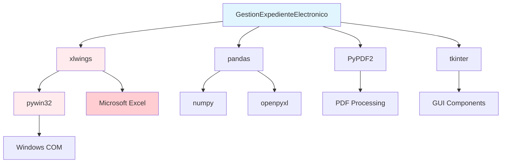

# Dependencias del Sistema

## Dependencias de Producción

### Dependencias Críticas

#### xlwings==0.28.5
```bash
pip install xlwings==0.28.5
```

**Propósito**: Automatización COM de Microsoft Excel  
**Criticidad**: 🔴 **CRÍTICA** - Sin esta dependencia la aplicación no funciona  
**Uso**: Generación de índices Excel, aplicación de fórmulas, apertura automática de archivos

**Configuración específica**:
```python
import xlwings as xw

# Configuración típica
app = xw.App(visible=False)  # Excel oculto durante procesamiento
wb = app.books.open(template_path)
```

**Requisitos adicionales**:
- Microsoft Excel debe estar instalado
- Compatible con Excel 2016, 2019, 365
- Requiere pywin32 para funcionamiento COM

#### pandas==1.5.2
```bash
pip install pandas==1.5.2
```

**Propósito**: Manipulación y análisis de datos estructurados  
**Criticidad**: 🟡 **IMPORTANTE** - Usado para procesamiento de metadatos  
**Uso**: Creación de DataFrames, manipulación de datos CSV, exportación a Excel

**Casos de uso principales**:
```python
import pandas as pd

# Lectura de datos de referencia
juzgados_df = pd.read_csv('JUZGADOS.csv')

# Creación de DataFrame para índice
index_data = pd.DataFrame({
    'Nombre_Documento': file_names,
    'Numero_Paginas': page_counts,
    'Fecha_Creacion': creation_dates
})
```

#### PyPDF2==2.11.2
```bash
pip install PyPDF2==2.11.2
```

**Propósito**: Procesamiento de archivos PDF  
**Criticidad**: 🟡 **IMPORTANTE** - Esencial para extracción de metadatos PDF  
**Uso**: Conteo de páginas, extracción de metadatos, manejo de archivos protegidos

**Funcionalidades utilizadas**:
```python
from PyPDF2 import PdfReader

def get_pdf_pages(file_path):
    try:
        reader = PdfReader(file_path)
        return len(reader.pages)
    except Exception as e:
        # Manejo de PDFs protegidos/corruptos
        return 0
```

#### pywin32==306
```bash
pip install pywin32==306
```

**Propósito**: Integración COM con Windows y Excel  
**Criticidad**: 🔴 **CRÍTICA** - Requerida para xlwings y automatización Windows  
**Uso**: Interfaz COM, servicios Windows, acceso a APIs nativas

**Componentes utilizados**:
- `win32com.client`: Cliente COM para Excel
- `pythoncom`: Inicialización COM
- `pywintypes`: Tipos de datos Windows

### Dependencias Importantes

#### Pillow>=8.3.2
```bash
pip install Pillow>=8.3.2
```

**Propósito**: Procesamiento de imágenes  
**Uso**: Manejo de iconos, imágenes en tooltips, recursos gráficos de la GUI  
**Casos de uso**: Carga de PNG/ICO para interfaz gráfica

#### send2trash>=1.8.0
```bash
pip install send2trash>=1.8.0
```

**Propósito**: Eliminación segura de archivos  
**Uso**: Envío de índices existentes a la papelera en lugar de eliminación permanente  
**Ventaja**: Permite recuperación de archivos eliminados por error

```python
from send2trash import send2trash

# Eliminación segura de índice existente
if existing_index.exists():
    send2trash(str(existing_index))
```

### Dependencias del Sistema Base

#### tkinter (incluido en Python)
**Propósito**: Framework GUI nativo de Python  
**Uso**: Interfaz gráfica principal, diálogos, widgets  
**Ventaja**: No requiere instalación adicional en instalaciones estándar de Python

**Componentes utilizados**:
```python
import tkinter as tk
from tkinter import ttk, filedialog, messagebox

# GUI principal
root = tk.Tk()
style = ttk.Style()
progress_bar = ttk.Progressbar(root)
```

## Dependencias de Desarrollo

### Testing y Quality Assurance

#### pytest>=6.0.0
```bash
pip install pytest>=6.0.0
```

**Propósito**: Framework de testing  
**Uso**: Ejecución de tests unitarios e integración  
**Configuración**: Ver `pytest.ini` para configuración específica

#### pytest-cov>=2.0.0
```bash
pip install pytest-cov>=2.0.0
```

**Propósito**: Análisis de cobertura de código  
**Uso**: Generación de reportes HTML de cobertura

#### black>=22.0.0
```bash
pip install black>=22.0.0
```

**Propósito**: Formateo automático de código  
**Configuración**: Línea máxima 88 caracteres
```bash
black --line-length=88 src/
```

#### flake8>=4.0.0
```bash
pip install flake8>=4.0.0
```

**Propósito**: Análisis estático de código (linting)  
**Configuración**: Compatible con formato Black
```bash
flake8 --max-line-length=88 --extend-ignore=E203 src/
```

#### isort>=5.0.0
```bash
pip install isort>=5.0.0
```

**Propósito**: Organización automática de imports  
**Configuración**: Perfil compatible con Black
```bash
isort --profile=black src/
```

### Build y Distribución

#### PyInstaller==5.13.0
```bash
pip install PyInstaller==5.13.0
```

**Propósito**: Creación de ejecutables standalone  
**Uso**: Empaquetado de la aplicación para distribución  
**Configuración**: Ver `config/main.spec`

#### pre-commit>=2.0.0
```bash
pip install pre-commit>=2.0.0
```

**Propósito**: Hooks de Git para calidad de código  
**Configuración**: Ver `.pre-commit-config.yaml`

### Documentación

#### mkdocs-material>=8.0.0
```bash
pip install mkdocs-material>=8.0.0
```

**Propósito**: Generación de documentación estática  
**Uso**: Esta documentación que estás leyendo

#### mkdocstrings[python]>=0.19.0
```bash
pip install mkdocstrings[python]>=0.19.0
```

**Propósito**: Generación automática de documentación API desde docstrings

## Análisis de Dependencias

### Mapa de Dependencias Críticas



### Compatibilidad de Versiones

#### Python
- **Mínimo**: 3.9.6
- **Recomendado**: 3.9.x o 3.10.x
- **Máximo probado**: 3.11.x

#### Sistema Operativo
- **Principal**: Windows 10/11
- **Compatible**: Windows 7/8.1 (con limitaciones)
- **Experimental**: Linux (sin soporte Excel completo)
- **No soportado**: macOS (limitaciones COM)

#### Microsoft Excel
- **Mínimo**: Excel 2016
- **Recomendado**: Excel 2019 o Microsoft 365
- **Arquitectura**: Preferiblemente 64-bit

### Resolución de Conflictos

#### Problema: Versiones incompatibles de pywin32
```bash
# Solución: Reinstalación limpia
pip uninstall pywin32 -y
pip install pywin32==306
python -m pywin32_postinstall -install
```

#### Problema: xlwings no detecta Excel
```bash
# Verificar instalación de Excel
python -c "import xlwings as xw; app = xw.App(); print('Excel detectado'); app.quit()"

# Si falla, reinstalar xlwings
pip uninstall xlwings -y
pip install xlwings==0.28.5
```

#### Problema: Dependencias circulares en pandas
```bash
# Actualizar numpy primero
pip install --upgrade numpy
pip install --upgrade pandas==1.5.2
```

## Seguridad de Dependencias

### Vulnerabilidades Conocidas

#### PyPDF2 - Advertencia de Seguridad
- **Versión actual**: 2.11.2 (última con compatibilidad probada)
- **Recomendación**: No procesar PDFs de fuentes no confiables
- **Mitigación**: Validación de archivos antes del procesamiento

#### Pillow - Updates de Seguridad
```bash
# Mantener actualizado para patches de seguridad
pip install --upgrade "Pillow>=8.3.2"
```

### Verificación de Integridad

#### Script de Verificación
```python
#!/usr/bin/env python3
"""
Verificar integridad y compatibilidad de dependencias.
"""

import subprocess
import sys
from importlib import import_module

def check_critical_imports():
    """Verificar que todas las dependencias críticas se puedan importar."""
    critical_modules = [
        'xlwings',
        'pandas', 
        'PyPDF2',
        'tkinter',
        'win32com.client',
        'PIL',
        'send2trash'
    ]
    
    results = {}
    for module_name in critical_modules:
        try:
            import_module(module_name)
            results[module_name] = "✅ OK"
        except ImportError as e:
            results[module_name] = f"❌ ERROR: {e}"
    
    return results

def check_excel_connectivity():
    """Verificar conectividad con Excel."""
    try:
        import xlwings as xw
        app = xw.App(visible=False)
        app.quit()
        return "✅ Excel COM disponible"
    except Exception as e:
        return f"❌ Excel COM error: {e}"

def main():
    print("🔍 Verificando dependencias críticas...")
    
    # Verificar imports
    import_results = check_critical_imports()
    for module, status in import_results.items():
        print(f"  {module}: {status}")
    
    # Verificar Excel
    print("\n🔍 Verificando conectividad Excel...")
    excel_status = check_excel_connectivity()
    print(f"  Excel COM: {excel_status}")
    
    # Verificar versiones
    print("\n📋 Versiones instaladas:")
    packages = ['xlwings', 'pandas', 'PyPDF2', 'pywin32', 'Pillow']
    for package in packages:
        try:
            result = subprocess.run([sys.executable, '-m', 'pip', 'show', package], 
                                  capture_output=True, text=True)
            if result.returncode == 0:
                for line in result.stdout.split('\n'):
                    if line.startswith('Version:'):
                        print(f"  {package}: {line.split(': ')[1]}")
        except Exception:
            print(f"  {package}: ❌ Error al obtener versión")

if __name__ == "__main__":
    main()
```

## Instalación Optimizada

### Archivo requirements.txt Completo

```txt
# Dependencias críticas de producción
xlwings==0.28.5
pandas==1.5.2
PyPDF2==2.11.2
pywin32==306

# Dependencias importantes
Pillow>=8.3.2
send2trash>=1.8.0

# Dependencias opcionales para funcionalidades específicas
python-docx>=0.8.11  # Para procesamiento Word mejorado
openpyxl>=3.0.9      # Para manipulación Excel adicional

# Solo para desarrollo (comentar en producción)
# pytest>=6.0.0
# pytest-cov>=2.0.0
# black>=22.0.0
# flake8>=4.0.0
# isort>=5.0.0
# mypy>=0.991
# pre-commit>=2.0.0
```

### Script de Instalación Automatizada

```bash
#!/bin/bash
# install_dependencies.sh

echo "🚀 Instalando dependencias de GestionExpedienteElectronico..."

# Verificar Python
python --version || { echo "❌ Python no encontrado"; exit 1; }

# Actualizar pip
echo "📦 Actualizando pip..."
python -m pip install --upgrade pip

# Instalar dependencias críticas en orden
echo "⚡ Instalando dependencias críticas..."
python -m pip install pywin32==306
python -m pip install xlwings==0.28.5
python -m pip install pandas==1.5.2
python -m pip install PyPDF2==2.11.2

# Post-instalación pywin32
echo "⚙️ Configurando pywin32..."
python -m pywin32_postinstall -install

# Instalar resto de dependencias
echo "📋 Instalando dependencias adicionales..."
python -m pip install -r requirements.txt

# Verificar instalación
echo "🧪 Verificando instalación..."
python -c "
import xlwings as xw
import pandas as pd
import PyPDF2
print('✅ Todas las dependencias instaladas correctamente')
"

echo "🎉 Instalación completada!"
```

---

!!! info "Mantenimiento de Dependencias"
    Revisa regularmente las actualizaciones de dependencias, especialmente las relacionadas con seguridad. Usa `pip-audit` para verificar vulnerabilidades conocidas.