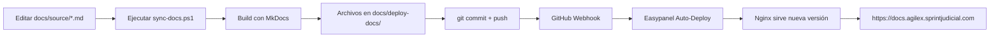

# Configuración de Easypanel para Documentación

Guía paso a paso para desplegar la documentación estática en Easypanel con auto-deploy desde GitHub.

## 📋 Prerrequisitos

- Cuenta en Easypanel con acceso a tu VPS
- Repositorio GitHub para `deploy-docs/` (ej: `AgilEx-Docs`)
- Dominio configurado: `docs.agilex.sprintjudicial.com`

## 🚀 Paso 1: Crear Repositorio en GitHub

```bash
# En el proyecto principal, después de ejecutar sync-docs.ps1
cd docs/deploy-docs

# Inicializar repositorio Git
git init
git branch -M main

# Agregar remote (reemplaza TU_USUARIO con tu usuario de GitHub)
git remote add origin https://github.com/TU_USUARIO/AgilEx-Docs.git

# Primer commit
git add .
git commit -m "Documentación inicial v1.5.0"
git push -u origin main
```

## 🔧 Paso 2: Configurar Aplicación en Easypanel

### 2.1 Crear Nueva Aplicación

1. Accede a tu panel de Easypanel
2. Click en **"Create Application"** o **"Nueva Aplicación"**
3. Selecciona **"From Source"** o **"Desde Código Fuente"**

### 2.2 Configurar Repositorio Git

- **Repository URL**: `https://github.com/TU_USUARIO/AgilEx-Docs.git`
- **Branch**: `main`
- **Build Method**: Selecciona **"Dockerfile"**

### 2.3 Configuración de Build

Easypanel detectará automáticamente el `Dockerfile` en la raíz del repositorio.

**Configuración recomendada:**

| Campo | Valor |
|-------|-------|
| **Build Method** | Dockerfile |
| **Dockerfile Path** | `./Dockerfile` (por defecto) |
| **Build Context** | `.` (raíz del repositorio) |
| **Port** | `80` |

### 2.4 Configurar Dominio

1. En la sección **"Domains"** o **"Dominios"**
2. Agrega: `docs.agilex.sprintjudicial.com`
3. Habilita **HTTPS/SSL** (Easypanel usa Let's Encrypt automáticamente)

### 2.5 Variables de Entorno (Opcional)

No se requieren variables de entorno para esta aplicación.

## 🔄 Paso 3: Configurar Auto-Deploy con GitHub Webhook

### 3.1 Obtener Webhook URL de Easypanel

1. En Easypanel, ve a la configuración de tu aplicación
2. Busca la sección **"Webhooks"** o **"Deploy Hooks"**
3. Copia la **Webhook URL** (algo como: `https://api.easypanel.io/webhooks/deploy/abc123...`)

### 3.2 Configurar Webhook en GitHub

1. Ve a tu repositorio `AgilEx-Docs` en GitHub
2. Click en **Settings** → **Webhooks** → **Add webhook**
3. Configura:
   - **Payload URL**: Pega la URL del webhook de Easypanel
   - **Content type**: `application/json`
   - **Secret**: (deja vacío o usa el que proporcione Easypanel)
   - **Events**: Selecciona **"Just the push event"**
   - **Active**: ✅ Marcado
4. Click en **"Add webhook"**

## ✅ Paso 4: Verificar Configuración

### 4.1 Primer Deploy Manual

En Easypanel, click en **"Deploy"** o **"Desplegar"** para el primer despliegue.

Monitorea los logs para verificar:
```
✅ Building Docker image...
✅ nginx:alpine pulled
✅ Copying files...
✅ Container started
✅ Listening on port 80
```

### 4.2 Probar Auto-Deploy

Haz un cambio en la documentación y pushea:

```bash
# Desde el proyecto principal
cd docs
.\sync-docs.ps1

# Hacer commit en deploy-docs/
cd deploy-docs
git add .
git commit -m "Actualiza documentación"
git push origin main

# GitHub webhook activará automáticamente Easypanel
```

### 4.3 Verificar Acceso

Abre en el navegador: **https://docs.agilex.sprintjudicial.com**

Deberías ver la documentación completa de MkDocs Material.

## 🔍 Troubleshooting

### El build falla

**Verificar logs en Easypanel:**
- Revisa que el `Dockerfile` esté en la raíz
- Confirma que todos los archivos HTML estén presentes

### El webhook no funciona

**Verificar en GitHub:**
1. Ve a Settings → Webhooks
2. Click en el webhook configurado
3. Revisa la pestaña **"Recent Deliveries"**
4. Debe mostrar respuestas `200 OK`

### Nginx no inicia

**Verificar puerto:**
- Easypanel debe exponer el puerto `80` del contenedor
- El dominio debe estar correctamente mapeado

### Error 404 en rutas

El `Dockerfile` ya incluye configuración Nginx para manejar rutas de documentación correctamente.

## 📊 Monitoreo

### Logs de Aplicación

En Easypanel, revisa los logs en tiempo real:
```
# Logs de Nginx
nginx: [notice] start worker processes
```

### Métricas

Easypanel proporciona métricas automáticas:
- CPU usage
- Memory usage
- Network I/O
- Request count

## 🔐 Seguridad

El `Dockerfile` incluye headers de seguridad:
- `X-Frame-Options: SAMEORIGIN`
- `X-Content-Type-Options: nosniff`
- `X-XSS-Protection: 1; mode=block`

### Recomendaciones Adicionales

1. **HTTPS forzado**: Easypanel maneja automáticamente
2. **Rate limiting**: Configurar en Easypanel si es necesario
3. **Backups**: Easypanel puede configurar backups automáticos

## 🎯 Flujo Completo de Actualización



## 📝 Checklist Final

- [ ] Repositorio `AgilEx-Docs` creado en GitHub
- [ ] `Dockerfile` y `.dockerignore` en raíz de deploy-docs/
- [ ] Aplicación creada en Easypanel con método "Dockerfile"
- [ ] Dominio `docs.agilex.sprintjudicial.com` configurado
- [ ] SSL/HTTPS habilitado
- [ ] Webhook de GitHub configurado
- [ ] Primer deploy manual exitoso
- [ ] Auto-deploy probado con push

---

**¡Listo!** Tu documentación ahora se despliega automáticamente cada vez que haces push a GitHub.
