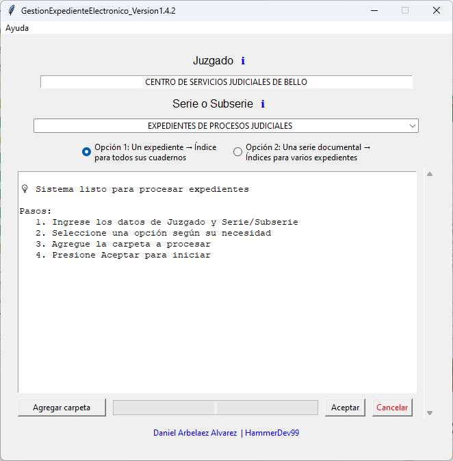

# Primeros Pasos

## Bienvenido a GestionExpedienteElectronico

Esta guía te llevará paso a paso a través de tu primera experiencia con la aplicación, desde el lanzamiento inicial hasta el procesamiento de tu primer expediente.

## Lanzar la Aplicación

### Desde Código Fuente

```bash
# Asegurar que el ambiente virtual está activo
.venv\Scripts\Activate  # Windows
source .venv/bin/activate  # Linux/macOS

# Ejecutar la aplicación
python src/__main__.py
```

### Desde Ejecutable

1. Navega a la carpeta donde descargaste `AgilEx_by_Marduk.exe`
2. Doble clic en el ejecutable
3. Si aparece una advertencia de seguridad de Windows, selecciona "Ejecutar de todos modos"

## Primera Ejecución

### Pantalla de Bienvenida

Al iniciar por primera vez, verás:



La interfaz principal contiene:

1. **🎯 Selector de Tipo de Procesamiento**: Dropdown para elegir el modo
2. **📁 Área de Información**: Muestra detalles del procesamiento seleccionado
3. **🔄 Botones de Acción**: Para iniciar el procesamiento
4. **📊 Barra de Progreso**: Indica el avance durante el procesamiento
5. **📝 Log de Actividad**: Muestra mensajes detallados en tiempo real
6. **⚙️ Herramientas**: Acceso a funcionalidades adicionales

## Comprender los Tipos de Procesamiento

### 1. Cuaderno Único
**¿Cuándo usar?** Cuando tienes una carpeta simple con documentos directos.

**Estructura esperada:**
```
📁 MiCuaderno/
├── 📄 01_Demanda.pdf
├── 📄 02_Contestacion.docx
├── 📄 03_Pruebas.xlsx
└── 📄 04_Sentencia.pdf
```

**Validación CUI:** Debe haber exactamente un CUI de 23 dígitos en el nombre de la carpeta.

### 2. Expediente Único  
**¿Cuándo usar?** Para expedientes con estructura jerárquica de 4 niveles.

**Estructura esperada:**
```
📁 ExpedienteComplejo/
├── 📁 Primera_Instancia/
│   ├── 📁 Cuaderno_Principal/
│   │   ├── 📄 Documento1.pdf
│   │   └── 📄 Documento2.docx
│   └── 📁 Cuaderno_Pruebas/
│       └── 📄 Prueba1.pdf
└── 📁 Segunda_Instancia/
    └── 📁 Cuaderno_Apelacion/
        └── 📄 Apelacion.pdf
```

### 3. Múltiples Expedientes
**¿Cuándo usar?** Para procesamiento masivo de múltiples expedientes por año.

**Estructura esperada:**
```
📁 Expedientes2024/
├── 📁 Expediente_001/
│   └── [estructura de expediente único]
├── 📁 Expediente_002/
│   └── [estructura de expediente único]
└── 📁 Expediente_003/
    └── [estructura de expediente único]
```

## Tu Primer Procesamiento

### Paso 1: Preparar los Archivos

1. **Crear carpeta de prueba** con algunos documentos PDF, Word o Excel
2. **Nombrar la carpeta** con un CUI válido (23 dígitos)
   ```
   Ejemplo: 12345678901234567890123_MiPrueba
   ```

### Paso 2: Seleccionar Tipo de Procesamiento

1. En la aplicación, despliega el **dropdown de tipo de procesamiento**
2. Selecciona **"Cuaderno Único"** para tu primera prueba
3. Observa cómo cambia la descripción en el área de información

### Paso 3: Iniciar el Procesamiento

1. Haz clic en **"Seleccionar Carpeta y Procesar"**
2. En el diálogo, navega y selecciona tu carpeta de prueba
3. La aplicación validará automáticamente la estructura

### Paso 4: Confirmación y Validación

Si todo está correcto, verás:

!!! success "Validación Exitosa"
    ✅ **Estructura válida**  
    ✅ **CUI válido detectado**: `12345678901234567890123`  
    ✅ **3 archivos encontrados**  
    ✅ **Formatos soportados**: PDF, DOCX, XLSX

Haz clic en **"Sí"** para confirmar el procesamiento.

### Paso 5: Observar el Procesamiento

Durante el procesamiento verás:

1. **Barra de progreso** actualizada en tiempo real
2. **Log de actividad** con detalles de cada archivo:
   ```
   [INFO] Iniciando procesamiento...
   [INFO] Procesando: 01_Demanda.pdf (5 páginas)
   [INFO] Procesando: 02_Contestacion.docx (3 páginas)
   [INFO] Procesando: 03_Pruebas.xlsx (1 hoja)
   [INFO] Generando índice Excel...
   [SUCCESS] ✅ Procesamiento completado exitosamente
   ```

### Paso 6: Revisar Resultados

Al finalizar:

1. **Se abrirá Excel** automáticamente con el índice generado
2. **Se mostrará el archivo** `IndiceElectronico_[CUI].xlsx` en la carpeta original
3. **Verificar los metadatos** extraídos automáticamente

## Comprender el Índice Generado

### Estructura del Excel

El índice generado contiene columnas como:

| Campo | Descripción | Ejemplo |
|-------|-------------|---------|
| Orden Documento | Número secuencial | 1, 2, 3... |
| Nombre Documento | Nombre del archivo | 01_Demanda.pdf |
| Fecha Creación | Fecha original del archivo | 2024-01-15 |
| Fecha Incorporación | Fecha de procesamiento | 2024-07-21 |
| Número de Páginas | Páginas extraídas automáticamente | 5 |
| Página Inicio | Calculada con fórmula | 1 |
| Página Fin | Calculada con fórmula | 5 |
| Formato | Extensión del archivo | PDF |
| Tamaño | En unidades legibles | 2.34 MB |
| Origen | Electrónico/Digitalizado | Electrónico |

### Fórmulas Automáticas

El sistema genera fórmulas Excel automáticamente:

```excel
# Página Inicio (columna F)
=IF(E2=1,1,SUM(E$1:E1)+1)

# Página Fin (columna G)  
=E2+F2-1
```

## Casos de Uso Comunes

### Validar CUI (Código Único de Identificación)

Los CUIs deben tener **exactamente 23 dígitos**:

✅ **Válidos:**
- `12345678901234567890123`
- `98765432109876543210987`

❌ **Inválidos:**
- `123456789012345678901` (22 dígitos)
- `1234567890123456789012345` (25 dígitos)  
- `1234567890123456789ABC` (contiene letras)

### Manejar Archivos Problemáticos

Si encuentras archivos que no se procesan:

1. **PDFs protegidos**: La aplicación los detecta y reporta
2. **Archivos corruptos**: Se omiten con mensaje de advertencia
3. **Formatos no soportados**: Solo PDF, Word, Excel son procesados

### Estructuras de Carpetas Incorrectas

La aplicación te alertará sobre:

- **Carpetas vacías** sin documentos
- **Subcarpetas inesperadas** en cuaderno único
- **CUIs faltantes** o inválidos
- **Niveles jerárquicos incorrectos**

## Consejos y Mejores Prácticas

### Organización de Archivos

1. **Nomenclatura consistente**: Usar prefijos numéricos (`01_`, `02_`)
2. **Evitar caracteres especiales**: Stick to alfanuméricos y guiones
3. **Tamaños razonables**: PDFs muy grandes pueden ser lentos de procesar

### Flujo de Trabajo Eficiente  

1. **Validar estructura** antes de procesamiento masivo
2. **Probar con muestra pequeña** antes de lotes grandes
3. **Revisar logs** para identificar problemas potenciales
4. **Backup de datos** importantes antes del procesamiento

### Solución de Problemas Rápidos

| Problema | Solución |
|----------|----------|
| "Excel no encontrado" | Verificar instalación completa de Excel |
| "CUI inválido" | Verificar que tenga exactamente 23 dígitos |
| "Carpeta vacía" | Asegurar que hay documentos soportados |
| "Proceso lento" | Archivos grandes pueden tomar tiempo |

## Siguientes Pasos

Una vez cómodo con el procesamiento básico:

1. **Explorar procesamiento de expedientes complejos**: Experimenta con los 3 tipos de procesamiento disponibles
2. **Usar herramientas adicionales**: Explorar el banco de herramientas
3. **Automatizar flujos**: Aprender sobre procesamiento por lotes

## Obtener Ayuda

### Durante el Uso
- **Tooltips interactivos**: Hover sobre elementos de la GUI
- **Log de actividad**: Revisar mensajes detallados
- **Ventana de herramientas**: Acceder a utilidades adicionales

### Recursos Adicionales
- **[Referencia](../reference/dependencies.md)**: Documentación técnica completa
- **[Arquitectura](../architecture/overview.md)**: Comprende el diseño del sistema
- **[Desarrollo](../development/environment-setup.md)**: Guía para contribuidores

---

!!! tip "¿Listo para más?"
    Una vez que hayas completado tu primer procesamiento exitoso, consulta la [Guía de Usuario](overview.md) para conocer funcionalidades avanzadas.