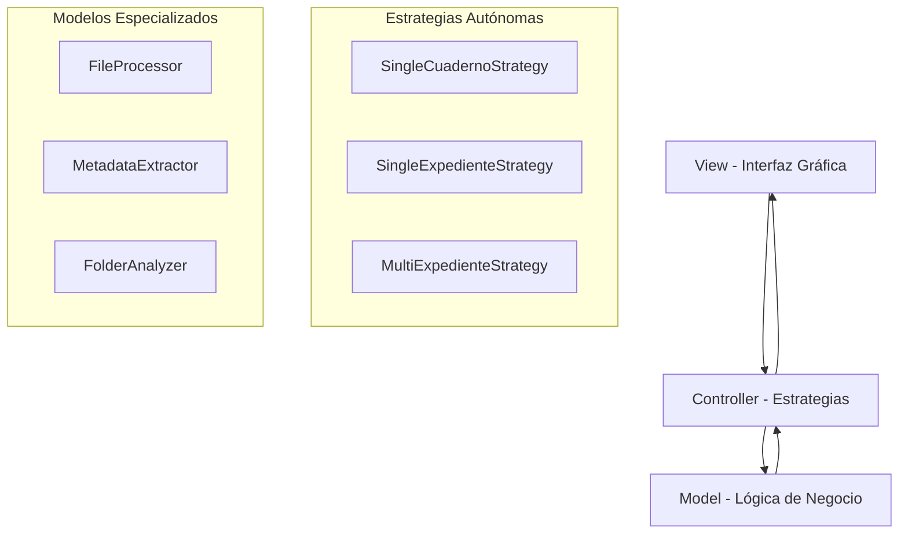

# Descripción General

## ¿Qué es GestionExpedienteElectronico_Version1?

GestionExpedienteElectronico_Version1 es una solución RDA (Robotic Desktop Automation) especializada en automatizar la creación de índices electrónicos para expedientes judiciales, cumpliendo con los estándares establecidos en el **Protocolo PCSJA20-11567 de 2020** del Plan Estratégico de Transformación Digital de la Rama Judicial colombiana.

## Propósito y Contexto Legal

### Marco Normativo

La aplicación se enmarca en el **Programa de Expediente Electrónico** de la Rama Judicial colombiana y se ajusta específicamente al protocolo:

**"Protocolo para la gestión de documentos electrónicos, digitalización y conformación del expediente electrónico" Versión 2.0**

[📄 Link directo al Protocolo](https://www.ramajudicial.gov.co/documents/3196516/46103054/Protocolo+para+la+gesti%C3%B3n+de+documentos+electronicos.pdf/cb0d98ef-2844-4570-b12a-5907d76bc1a3)

### Automatización de Procesos Administrativos

El software automatiza tareas que tradicionalmente se realizan de forma manual:

- **Antes**: Un empleado judicial debe revisar cada documento, extraer metadatos manualmente y crear el índice
- **Ahora**: La aplicación procesa automáticamente carpetas completas y genera índices estandarizados

## Funcionalidades Principales

### 🔍 Análisis Automático de Documentos

La aplicación puede procesar automáticamente:

- **PDF**: Extracción de páginas, metadatos y propiedades
- **Word** (.docx, .doc): Conteo de páginas y datos del documento
- **Excel** (.xlsx, .xls): Información de hojas y estructura

### 📊 Extracción de Metadatos

Para cada documento, la aplicación extrae:

| Metadato | Descripción | Origen |
|----------|-------------|--------|
| Nombre Documento | Nombre del archivo | Sistema de archivos |
| Fecha Creación | Fecha de creación original | Propiedades del archivo |
| Fecha Incorporación | Fecha de incorporación al expediente | Automático (fecha actual) |
| Número de Páginas | Total de páginas del documento | Análisis del contenido |
| Formato | Tipo de archivo (PDF, DOCX, etc.) | Extensión del archivo |
| Tamaño | Tamaño en unidades legibles | Sistema de archivos + conversión |
| Origen | Electrónico o Digitalizado | Configuración o análisis |

### 📋 Generación de Índices

- **Formato Excel estandarizado**: Compatible con plantillas oficiales
- **Fórmulas automáticas**: Para cálculo de página inicio/fin
- **Validación integrada**: Verificación de estructura y coherencia

## Tipos de Procesamiento Soportados

### 1. Cuaderno Único
- **Estructura**: Plana (archivos directos en carpeta)
- **Uso**: Procesos simples con un solo cuaderno
- **Validación**: CUI individual de 23 dígitos

### 2. Expediente Único
- **Estructura**: 4 niveles jerárquicos
- **Uso**: Expedientes complejos con múltiples instancias y cuadernos
- **Niveles**: `Expediente → Instancia → Cuaderno → Archivos`

### 3. Múltiples Expedientes
- **Estructura**: 5 niveles jerárquicos
- **Uso**: Procesamiento masivo de múltiples expedientes
- **Niveles**: `Año → Expediente → Instancia → Cuaderno → Archivos`

## Arquitectura del Sistema

### Patrón MVC Implementado

### Características Arquitectónicas

- **Estrategias 100% autónomas**: Cada tipo de procesamiento es completamente independiente
- **Patrón Observer**: Notificaciones en tiempo real a la interfaz
- **Factory Pattern**: Creación de extractores según tipo de archivo
- **Bajo acoplamiento**: Separación estricta entre GUI y lógica de negocio

## Flujo de Trabajo Típico

### 1. Selección de Modo
El usuario selecciona uno de los tres tipos de procesamiento disponibles.

### 2. Selección de Carpeta
Cada estrategia maneja su propia selección de carpeta con validaciones específicas.

### 3. Análisis y Validación
- Verificación de estructura de carpetas
- Validación de CUIs (Códigos Únicos de Identificación)
- Detección de problemas estructurales

### 4. Confirmación
El sistema presenta un resumen y solicita confirmación del usuario.

### 5. Procesamiento
- Extracción de metadatos de cada documento
- Generación del índice Excel
- Notificaciones de progreso en tiempo real

### 6. Finalización
- Índice generado y guardado
- Reportes de procesamiento
- Notificación de finalización

## Ventajas del Sistema

### Para Usuarios Finales
- **Ahorro de tiempo**: Automatización de tareas manuales repetitivas
- **Consistencia**: Formato estandarizado en todos los índices
- **Precisión**: Eliminación de errores manuales en metadatos

### Para Administradores
- **Escalabilidad**: Procesamiento de múltiples expedientes
- **Trazabilidad**: Logs detallados de todas las operaciones
- **Mantenimiento**: Arquitectura modular fácil de mantener

### Para Desarrolladores
- **Extensibilidad**: Fácil adición de nuevas estrategias
- **Testabilidad**: Componentes independientes y testeable
- **Mantenibilidad**: Código limpio siguiendo principios SOLID

## Casos de Uso Principales

### Oficinas Judiciales Pequeñas
- Procesamiento de cuadernos únicos
- Expedientes individuales ocasionales
- Interfaz simple y directa

### Juzgados y Tribunales
- Expedientes complejos con múltiples instancias
- Procesamiento regular de casos
- Validaciones estrictas de estructura

### Archivos Judiciales
- Procesamiento masivo de expedientes históricos
- Organización por años y períodos
- Generación de índices para digitalización

## Integración con Herramientas Existentes

### Microsoft Excel
- **Requisito crítico**: Excel debe estar instalado
- **Automatización COM**: Integración directa con xlwings
- **Plantillas oficiales**: Uso de formatos estandarizados

### Sistema de Archivos
- **Multiplataforma**: Soporte para Windows principalmente
- **Detección automática**: Identificación de tipos de archivo
- **Validación de permisos**: Verificación de acceso a carpetas

---

!!! tip "Próximos Pasos"
    Continúa con la [Guía de Instalación](installation.md) para configurar el sistema en tu entorno.